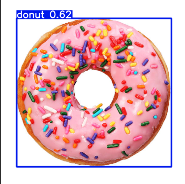

## โปรแกรมตรวจจับวัตถุด้วย YOLOv5
Object Detection with YOLOv5
รายละเอียดโปรแกรม
โปรแกรมนี้ใช้ YOLOv5 (You Only Look Once version 5) ซึ่งเป็นโมเดล Object Detection ที่สามารถตรวจจับและระบุพิกัดของวัตถุในภาพหรือวิดีโอได้อย่างรวดเร็วและแม่นยำ

หลักการทำงาน

1️⃣ โหลดโมเดล YOLOv5
ใช้โมเดลสำเร็จรูปที่ผ่านการฝึก เช่น yolov5s.pt

หรือสามารถฝึกโมเดลใหม่จากข้อมูลที่กำหนดเอง

2️⃣ รับอินพุต
รองรับการประมวลผลจาก ไฟล์ภาพ (.jpg, .png)

รองรับ วิดีโอ (.mp4) และ กล้องเว็บแคม

3️⃣ ประมวลผลภาพ
ตรวจจับวัตถุโดยให้ผลลัพธ์เป็น กรอบสี่เหลี่ยม (Bounding Box)

แสดง ป้ายชื่อวัตถุ พร้อม ค่าความมั่นใจ (Confidence Score)

4️⃣ แสดงผล
วาดกรอบรอบวัตถุที่ตรวจพบ

แสดงชื่อวัตถุพร้อมค่าความมั่นใจบนภาพ

